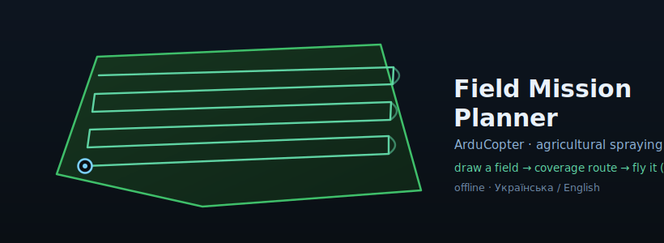

# Field Mission Planner — ArduCopter (agricultural spraying)



[](https://github.com/tecelskyyivan-alt/ardu-field-planner/actions/workflows/tests.yml)
[](LICENSE)
[](https://github.com/tecelskyyivan-alt/ardu-field-planner/releases/latest)

<!-- Tip: drop a real app screenshot at docs/screenshot.png and uncomment:
 -->

> ⚠️ **SAFETY / БЕЗПЕКА — read before use.** This software plans and uploads flight
> missions for **real spraying drones**. A mistake can crash the aircraft, spray the
> wrong area, or cause injury and crop/property damage. It is provided **WITH NO
> WARRANTY** (see [LICENSE](LICENSE)). **You are the pilot-in-command:** review every
> mission in Mission Planner / QGroundControl, keep visual line-of-sight and a manual
> override, and obey your local drone **and pesticide** regulations. Use at your own risk.
>
> Цей софт планує й заливає польотні місії для **реальних дронів-обприскувачів**.
> Помилка = розбитий дрон / не те поле / шкода людям чи посівам. Надається **БЕЗ ЖОДНИХ
> ГАРАНТІЙ**. Ти — командир екіпажу: перевіряй кожну місію, тримай візуальний контакт і
> ручний override, дотримуйся законів про дрони й пестициди. Використання на власний ризик.

**Offline-first ground-control station + coverage-mission planner for ArduCopter
agricultural spraying.** Draw a field on a satellite map → generate a boustrophedon
(“lawnmower”) coverage route → export a mission (`.plan` / `.waypoints`) or **upload it
straight to the drone over MAVLink** and fly it with **live telemetry**. Works fully
offline (self-hosted map + engine, no CDN). Bilingual UI (**Українська / English**).

Офлайн-планувальник маршрутів покриття поля + наземна станція (GCS) для ArduCopter.
Малюєш контур поля → «змійка» покриття → експорт місії або **пряма заливка в дрон по
MAVLink** (кабель / WiFi-ELRS) + жива телеметрія.

## Platforms / Платформи

| | |
|---|---|
| 🖥️ **Desktop (Windows / macOS)** | native window on Qt / QtWebEngine (`app_qt.py`) |
| 📱 **Android** | native APK (`android/`) — USB-serial to the FC + MAVLink over WiFi (ELRS backpack) |
| 🍎 **iOS** | native shell (`ios/`) — MAVLink over WiFi |
| 🌐 **Browser / PWA** | any Chromium/Safari; install as an offline PWA |

## Features / Можливості

- 🛰️ **Satellite map** (Google / Esri) with layer switching and place/border labels.
- ✏️ **Field contour** — draw a polygon, drag vertices (route rebuilds live). Fully
  offline, manual (no cloud / no AI required).
- 🌳 **Obstacles (cut-outs)** — draw polygons over trees / roads / ponds; cut from the
  route **and** added to the geofence; saved with the project.
- 🔁 **Coverage** — pass spacing, angle (or **auto-angle** = least mission time / least
  spray overlap), edge margin, waypoint de-clustering.
- 🔄 **Rounded turns** — the copter flies a smooth U-turn at each pass end via the
  autopilot’s `WP_RADIUS_M` (= spacing / 2); no extra waypoints.
- 📍 **Start/finish anchor** — pulls the route ends toward the drone’s GPS / your GPS /
  take-off point to cut transit and flight time.
- 🔋 **Split into sorties** — **N equal-area** sections or by battery time; per-flight export.
- ⏱️ **Realistic mission time** — take-off + transit + cruise + turns + RTL + landing.
- 📈 **Flight log + calibration** — every real AUTO flight is logged offline (IndexedDB);
  plan-vs-actual calibrates the time / battery estimate to *your* drone.
- 💧 **Spray-liquid planning** — rate (l/ha) × sprayed area → working liquid + tank refills.
- 🚁 **Live flight (MAVLink)** — mission upload with read-back verify, telemetry/HUD, live
  “time to finish / to landing”, ARM / mode / AUTO / RTL, GPS jamming/spoofing guard.
  - **Over cable (USB serial)** and **over WiFi** (ELRS backpack, UDP). The WiFi link and
    mission upload are hardened for the narrow/lossy ELRS uplink (proactive re-send,
    ArduPilot `MISSION_ITEM_INT` **and** INAV `MISSION_ITEM` dialects).
- 💾 **Export** — `.waypoints` (QGC WPL 110), `.plan`, geofence `.plan` / `.fence`, `.geojson`; **KML** import/export.
- 🗺️ **Multi-field KML import** — load a whole GIS field database (named parcels with
  cut-outs & areas); tap a contour on the map to pick it, or select several adjacent
  parcels and **merge** them into one field (gaps/field-roads closed); recent imports
  kept for one-tap reload.
- 📁 **Projects** — field + parameters + cut-outs; auto-restore of the last field & settings.
- 🌍 **UA / EN** language toggle (persisted).

## Download / Завантажити

**📥 Ready-to-use builds are on the [Releases page](https://github.com/tecelskyyivan-alt/ardu-field-planner/releases/latest).**

- **Android (phone/tablet):** download **`FieldMissionPlanner-….apk`** from the latest release →
  open it on the device → allow *install from unknown sources* → open the app.
  *(Готові збірки — на сторінці [Releases](https://github.com/tecelskyyivan-alt/ardu-field-planner/releases/latest): завантаж `.apk`, відкрий на телефоні, дозволь встановлення з невідомих джерел.)*
- **PC (Windows / macOS) & browser:** no prebuilt binary yet — run from source (below). Then open
  the native desktop window (`python app_qt.py`) or the browser UI (`python serve.py`).
- **iOS:** build from `ios/` with Xcode (Apple does not allow installing apps from a website).

## Build from source / Встановлення з коду

Requires **Python 3.11+** (desktop / browser modes).

```bash
git clone https://github.com/tecelskyyivan-alt/ardu-field-planner
cd ardu-field-planner
python3 -m venv .venv
# macOS / Linux:  source .venv/bin/activate
# Windows:        .\.venv\Scripts\Activate.ps1
pip install -r requirements.txt
```

Leaflet and the planning engine are self-hosted (no CDN) — it runs fully offline.

## Run / Запуск

**Native desktop (recommended)** — a Qt / QtWebEngine window:
```bash
python app_qt.py
```
The HTTP backend (`serve.py`) runs on a background thread; the UI is served at
`http://127.0.0.1:8731/`.

**Browser mode:**
```bash
python serve.py      # then open the printed http://127.0.0.1:<port>/
```

**Android / iOS** — build the native app from `android/` (Gradle, JDK 17, Android SDK)
or `ios/` (Xcode). See `THIRD_PARTY.md`.

## How to use / Як користуватись

1. **Set the field** — draw the polygon and edit its vertices.
2. **Obstacles** (optional) — draw obstacle polygons to cut from the coverage.
3. **Parameters** — altitude, spacing, angle (or auto-angle), margin, speed, battery,
   l/ha + tank (for liquid planning), rounded turns.
4. **Build route** — the coverage snake + statistics.
5. **Export or upload** — save `.waypoints` / `.plan` (open in Mission Planner / QGC,
   check the home point, upload) **or** connect over MAVLink (cable / WiFi) and upload
   directly, then fly with live telemetry.

## Architecture / Архітектура

```
app_qt.py            # native window (PySide6 / QtWebEngine) + serve.start()
serve.py             # stdlib HTTP server (:8731) + /api/* routing
backend/
  api.py             # bridge: build_route (time / sections / anchor / calibration), export, MAVLink
  coverage.py        # boustrophedon snake, cut-outs, margin, auto-angle, areas, mission time, splits
  mission.py         # export .waypoints / .plan / geofence / .fence / .geojson
  mavlink_link.py    # live MAVLink over cable (COM) / UDP / TCP: telemetry + mission upload
  geo.py, flight_calib.py
web-stable/          # Leaflet + Leaflet.draw frontend (index.html · app.js · i18n.js · mav/*)
android/  ios/       # native shells (USB-serial + MAVLink-over-WiFi bridges)
```

## Tests / Тести

```bash
python test_core.py        # coverage / mission / geo
python test_features.py    # margin, auto-angle, cut-outs, liquid, export
python test_ui.py          # app.js element ids <-> index.html
python test_serve.py       # HTTP layer
python test_mavlink.py     # MAVLink over a fake UDP drone
python test_sitl.py        # E2E against a real ArduCopter SITL (upload -> verify -> download)
```

## Mission format / Формат місії

- WP0 = HOME (field centroid, absolute frame) — the GCS overwrites it with the real home on upload.
- Take-off `MAV_CMD_NAV_TAKEOFF` (GLOBAL_RELATIVE_ALT); waypoints `MAV_CMD_NAV_WAYPOINT`;
  end `MAV_CMD_NAV_RETURN_TO_LAUNCH` (if RTL).
- Geofence: an inclusion polygon of the field + one exclusion polygon per obstacle.

---

## License / Ліцензія

**GPLv3** — see [LICENSE](LICENSE). Third-party components & attribution: [THIRD_PARTY.md](THIRD_PARTY.md).

## Security / Безпека

Vulnerability & safety policy — [SECURITY.md](SECURITY.md).
